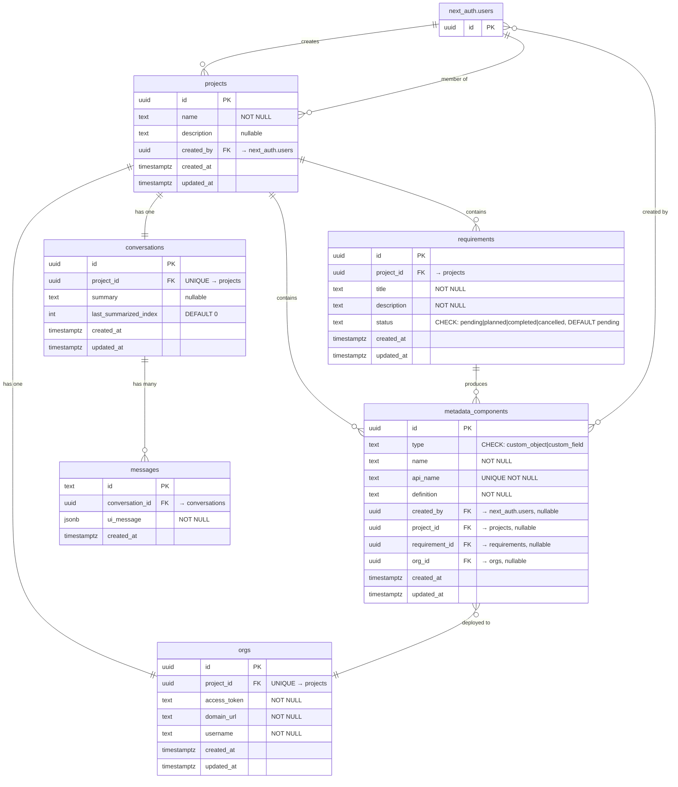

# Data Model

Supabase Postgres, evolved through 7 migrations. Note: the TypeScript type definitions in `src/types/database.ts` are out of sync with the actual schema — use this as source of truth.

## Tables

**projects** — Top-level container. Groups users, an org, a conversation, and requirements.

**orgs** — Salesforce org credentials. One per project.

**conversations** — One shared chat thread per project. Supports AI summarization.

**messages** — Chat turns. Stores the full UIMessage as JSONB.

**requirements** — Salesforce work items captured during Plan mode.

**metadata_components** — Records of deployed Salesforce metadata (objects and fields).

Users are managed by NextAuth in the `next_auth` schema, not in `public`.

## ERD

## Migrations

| # | File | What changed |
|---|------|-------------|
| 1 | `20240507000000` | Created `users`, `projects`, `orgs`, `conversations`, `messages` (with `role`+`content`), `requirements`, `actions`, `metadata_components`. Indexes, triggers for `updated_at`. |
| 2 | `20240511000001` | Added `project_id` to `metadata_components`. |
| 3 | `20240512000000` | Dropped `users` table. Re-pointed `projects.created_by` and `metadata_components.created_by` to `next_auth.users`. |
| 4 | `20250516000000` | Dropped `actions` table entirely. Added `requirement_id` + `org_id` to `metadata_components`. |
| 5 | `20260513104503` | Dropped `role` and `content` from `messages`. Added `ui_message JSONB NOT NULL`. |
| 6 | `20260513121551` | Changed `messages.id` from UUID to TEXT. |
| 7 | `20260521095120` | Added `summary` and `last_summarized_index` to `conversations`. |
