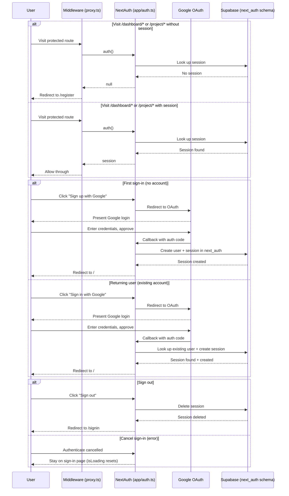

# Authentication

Google OAuth via NextAuth v5. Supabase adapter stores sessions in the `next_auth` schema. Middleware guards `/dashboard/*` and `/project/*`.

**Files:** `app/auth.ts`, `app/api/auth/[...nextauth]/route.ts`, `proxy.ts`, `lib/supabase.ts`, `lib/supabase-client.ts`, `app/(auth)/register/page.tsx`, `app/(auth)/signin/page.tsx`, `app/(auth)/signout/page.tsx`

## Configured at `app/auth.ts`

NextAuth v5 is bootstrapped with a single Google provider and the Supabase adapter. The adapter uses `NEXT_PUBLIC_SUPABASE_URL` + `SUPABASE_SERVICE_ROLE_KEY` to write sessions into the `next_auth` schema.

```typescript
import nextAuth from "next-auth";
import Google from "next-auth/providers/google";
import { SupabaseAdapter } from "@auth/supabase-adapter";

export const { auth, handlers, signIn, signOut } = nextAuth({
  providers: [Google],
  adapter: SupabaseAdapter({
    url: process.env.NEXT_PUBLIC_SUPABASE_URL!,
    secret: process.env.SUPABASE_SERVICE_ROLE_KEY!,
  }),
  callbacks: {
    async session({ session, user }) {
      if (user?.id) {
        session.user.id = user.id;
      }
      return session;
    },
  },
});
```

The session callback copies the Supabase user UUID from the adapter's `user` object into `session.user.id`. This means every downstream consumer (root layout, API routes) has the UUID available without querying Supabase by email.

## Auth Route Handler

`app/api/auth/[...nextauth]/route.ts` is a thin re-export of NextAuth's handlers:

```typescript
import { handlers } from "@/app/auth";
export const { GET, POST } = handlers;
```

## Sequence Diagram



## Session Distribution

Session data reaches the frontend through two separate paths:

- **Root layout** (`app/layout.tsx`) calls `auth()` server-side, then passes the session to `<SessionProvider>` so client components use `useSession()` / `signIn()` / `signOut()` from `next-auth/react`.

- **API routes** call `auth()` directly. With the session callback in place, `session.user.id` contains the Supabase user UUID — no extra database lookup needed.

## Two Supabase Clients

| Client | File | Key used | Purpose |
|---|---|---|---|
| Server-side | `lib/supabase.ts` | `SUPABASE_SERVICE_ROLE_KEY` | API routes, bypasses RLS |
| Client-side | `lib/supabase-client.ts` | `NEXT_PUBLIC_SUPABASE_ANON_KEY` | Browser components, respects RLS |

## Ownership Verification in API Routes

Every protected API route verifies the user owns the resource by comparing against `session.user.id` directly. No email-based user lookup is performed.

**Example — project ownership check (GET /api/projects):**

```typescript
const session = await auth();
if (!session?.user?.id) {
  return NextResponse.json({ error: "Unauthorized" }, { status: 401 });
}

const { data: projects } = await supabase
  .from("projects")
  .select("*")
  .eq("created_by", session.user.id);
```

This pattern is used in `app/api/projects/route.ts` (GET, POST), `app/api/projects/[id]/route.ts` (GET, PUT, DELETE), and `app/api/projects/[id]/metadata/route.ts` (GET).

## Auth Pages

| Route | File | Key behavior |
|---|---|---|
| `/register` | `app/(auth)/register/page.tsx` | `signIn('google', { redirectTo: '/', callbackUrl: '/' })` |
| `/signin` | `app/(auth)/signin/page.tsx` | `signIn('google', { redirectTo: '/' })` |
| `/signout` | `app/(auth)/signout/page.tsx` | `signOut({ redirectTo: '/signin' })` |

On sign-in/sign-up failure, the `isLoading` state is manually reset in the catch block since no `onError` callback is defined in the NextAuth config.
