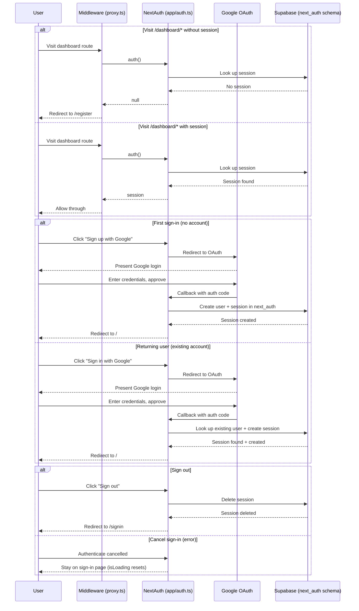

# Authentication

Google OAuth via NextAuth v5. Supabase adapter stores sessions in the `next_auth` schema. Middleware guards `/dashboard/*` only.

**Files:** `app/auth.ts`, `app/api/auth/[...nextauth]/route.ts`, `proxy.ts`, `lib/supabase.ts`, `lib/supabase-client.ts`, `app/(auth)/register/page.tsx`, `app/(auth)/signin/page.tsx`, `app/(auth)/signout/page.tsx`

## Sequence Diagram

## Session Distribution

Session data reaches the frontend through two separate paths:

- **Root layout** (`app/layout.tsx`) calls `auth()` server-side, then passes the session to `<SessionProvider>` so client components use `useSession()` / `signIn()` / `signOut()` from `next-auth/react`.
- **API routes** call `auth()` directly to get the session, then look up the Supabase user by email in the `next_auth` schema.
