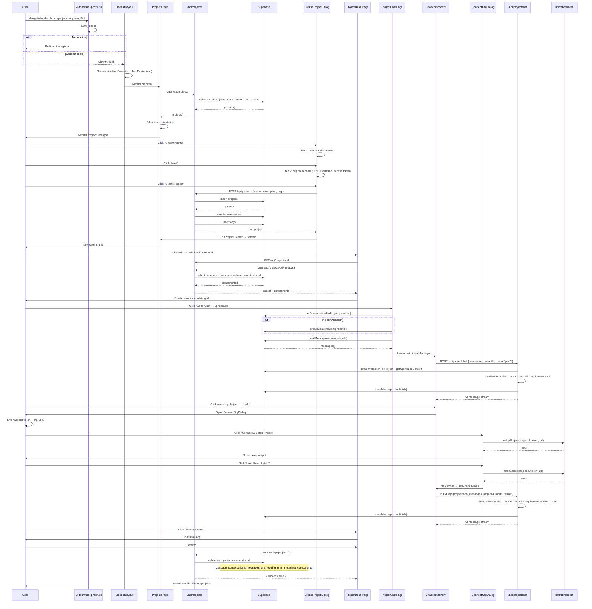
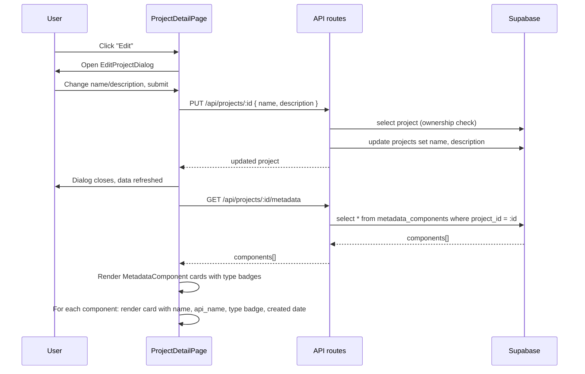

# Projects

Project listing, detail, and chat interface. Projects are owned by a single user (`created_by`). No multi-user membership. Middleware `proxy.ts` guards `/dashboard/:path*` and `/project/:path*`.

**Files:** `app/dashboard/projects/page.tsx`, `app/dashboard/project/[projectId]/page.tsx`, `app/project/[projectId]/page.tsx`, `app/project/[projectId]/actions.ts`, `components/chat/project-chat.tsx`, `components/chat/chat.tsx`, `components/chat/connect-org-dialog.tsx`, `components/chat/requirements-list.tsx`, `components/projects/project-card.tsx`, `components/projects/create-project-dialog.tsx`, `components/projects/edit-project-dialog.tsx`, `components/projects/delete-project-dialog.tsx`, `components/layout/sidebar-layout.tsx`, `app/api/projects/route.ts`, `app/api/projects/[id]/route.ts`, `app/api/projects/[id]/metadata/route.ts`, `hooks/use-project-name.ts`, `hooks/use-requirements.ts`, `lib/chat-store.ts`

## Project Listing

`app/dashboard/projects/page.tsx` is a client component that fetches projects via `GET /api/projects`, then renders a searchable/sortable grid of `ProjectCard` components. Sorting (newest/oldest/name) and search (by name) are client-side. Cards show project name, description, creation date, and an "Open Chat" button. Each card has a dropdown for Edit and Delete, which open `EditProjectDialog` and `DeleteProjectDialog` respectively. Creating a project opens `CreateProjectDialog`, a two-step form: step 1 collects name + description, step 2 collects org credentials (instance URL, username, access token). On submit, it calls `POST /api/projects`.

```typescript
const response = await fetch("/api/projects", {
  method: "POST",
  headers: { "Content-Type": "application/json" },
  body: JSON.stringify({
    name: name.trim(),
    description: description.trim(),
    org: { domain_url: domainUrl, username, access_token: accessToken },
  }),
});
```

## Project Detail

`app/dashboard/project/[projectId]/page.tsx` is a server component that fetches the project via `GET /api/projects/:id` and its metadata components via `GET /api/projects/:id/metadata` in parallel. It renders: project info card (name, description, created/updated dates, metadata component count), a metadata components grid (cards with type badge — "Custom Object" or "Custom Field"), and a danger zone with "Delete Project". Clicking "Go to Chat" navigates to `/project/[projectId]`.

## Chat Interface

`app/project/[projectId]/page.tsx` is a server component. It calls `getConversationForProject(projectId)` from `lib/chat-store.ts`, falls back to `createConversation(projectId)` if none exists, then loads all messages via `loadMessages`. It passes `initialMessages` and `projectId` to `ProjectChat`.

```typescript
const conversation =
  (await getConversationForProject(projectId)) ??
  (await createConversation(projectId));
const messages = await loadMessages(conversation.id);
return <ProjectChat projectId={projectId} initialMessages={messages} />;
```

`ProjectChat` (`components/chat/project-chat.tsx`) is a full-screen client component with a resizable panel layout: left = `Chat` component, right = `RequirementsList` (toggleable). It manages plan/build mode via `mode` state. The mode toggle button in the chat input switches between plan and build. Switching from plan → build opens `ConnectOrgDialog`. Switching from build → plan is instant.

## ConnectOrgDialog

`components/chat/connect-org-dialog.tsx` is a two-step sequential dialog:

1. **Project Setup** — calls `setupProject(projectId, accessToken, orgUrl)` from `lib/sfdx/project`
2. **Fetch Latest** — calls `fetchLatest(projectId, accessToken, orgUrl)` from `lib/sfdx/project`

Each step shows a status indicator (pending → running → success/error) with terminal-style output. On completion, `onSuccess` fires and the chat transitions to build mode.

```typescript
const result = await setupProject(projectId, accessToken.trim(), orgUrl.trim());
setSteps((prev) =>
  prev.map((s, i) =>
    i === 0 ? { ...s, status: "success", output: JSON.stringify(result.data, null, 2) } : s
  )
);
```

## Chat & ProjectChat API

`components/chat/chat.tsx` uses `useChat` from `@ai-sdk/react` with a `DefaultChatTransport` pointing to `/api/projectchat`. The request body includes `projectId` and `mode` ("plan" or "build"). Plan mode uses requirement tools only. Build mode uses requirement tools + SFDX tools.

```typescript
const { messages, sendMessage } = useChat({
  id: projectId,
  messages: initialMessages,
  transport: new DefaultChatTransport({
    api: "/api/projectchat",
    prepareSendMessagesRequest({ messages, id, body }) {
      return { body: { messages, projectId: id, ...body } };
    },
  }),
});
```

`app/api/projectchat/route.ts` handles both modes. It loads conversation context, project details, and optimized message history (with summarization). Plan mode streams with requirement tools. Build mode streams with requirement + SFDX tools. Both save the assistant's response to the messages table on finish.

## Server Actions

`app/project/[projectId]/actions.ts` provides three server actions for the requirements panel:

- `getProjectRequirements(projectId)` — fetches all requirements for a project, ordered by `created_at`
- `updateRequirement(id, title, description, projectId)` — updates a requirement, then calls `revalidatePath`
- `deleteRequirement(id, projectId)` — deletes a requirement, then calls `revalidatePath`

## Requirements List

`components/chat/requirements-list.tsx` renders requirements as collapsible accordion items. Each item shows a chevron toggle, title, color-coded status badge (Pending/Planned/Completed/Cancelled), and Markdown-rendered description when expanded. Edit and delete buttons appear when expanded.

## APIs

### `GET /api/projects`

Lists all projects for the current user.

```typescript
const { data: projects } = await supabase
  .from("projects")
  .select("*")
  .eq("created_by", session.user.id)
  .order("created_at", { ascending: false });
```

### `POST /api/projects`

Creates a project + conversation + org in sequence.

```typescript
const { data: project } = await supabase
  .from("projects")
  .insert({ name, description, created_by: session.user.id })
  .select()
  .single();
await supabase.from("conversations").insert({ project_id: project.id });
await supabase.from("orgs").insert({
  project_id: project.id,
  domain_url,
  username,
  access_token,
});
```

### `GET /api/projects/[id]`

Fetches a single project. Checks ownership via `created_by`.

### `PUT /api/projects/[id]`

Updates name and description. Checks ownership.

### `DELETE /api/projects/[id]`

Deletes a project. Database cascade cleans up related records.

### `GET /api/projects/[id]/metadata`

Fetches metadata components for a project, ordered by `created_at DESC`. Checks ownership.

## Sequence Diagram




