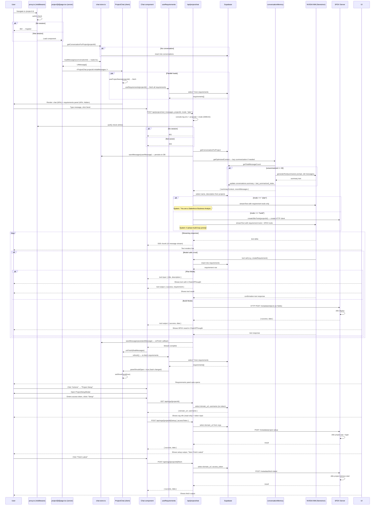

# Chat

Two chat endpoints exist. One is a public playground. One is the production agent endpoint with project context, tool calling, and conversation memory. The chat page (`/project/:id`) loads all conversation messages eagerly, streams AI responses via the Vercel AI SDK, and renders tool calls inline with a collapsible "Thinking" section. A mode toggle switches between "Plan" (requirement gathering) and "Build" (metadata deployment).

**Files:** `app/api/chat/route.ts`, `app/api/projectchat/route.ts`, `app/project/[projectId]/page.tsx`, `app/project/[projectId]/actions.ts`, `components/chat/chat.tsx`, `components/chat/project-chat.tsx`, `components/chat/requirements-list.tsx`, `components/chat/project-setup-modal.tsx`, `components/chat/fetch-latest-modal.tsx`, `lib/chat-store.ts`, `lib/conversationMemory.ts`, `lib/tools/requirements.ts`, `lib/tools/index.ts`, `lib/tools/prompts/requirements.ts`, `lib/tools/prompts/build.ts`, `lib/sfdx/sfdx.index.ts`, `lib/sfdx/objects.ts`, `lib/sfdx/fields.ts`

---

## Two Chat Endpoints

### `/api/chat/route.ts` — Playground (unused in production)

A bare AI chat endpoint with no auth, no project context, no tools. Streams responses from NVIDIA Nemotron. Hardcoded `stopWhen: stepCountIs(5)`. Rendered only by the standalone `/chat/page.tsx` route, which is NOT behind the auth middleware. Anyone can hit it. It exists for quick testing.

```typescript
const text = streamText({
  model,
  messages: await convertToModelMessages(messages),
  system: `You are a helpful assistant. you will help users with configuring salesforce.`,
  stopWhen: stepCountIs(5),
});
```

### `/api/projectchat/route.ts` — Production Endpoint

The real chat engine. Handles authentication, ownership checks, conversation loading, context optimization, mode-based tool routing, and streaming.

---

## Route Handling

### Auth and Ownership Check

An inline check (not in middleware) verifies the session user owns the project. A comment in the code documents that this was added as a fix — the route was previously missing the gate entirely. Without it, any authenticated user who guesses a projectId could read its conversation and trigger SFDX commands against its connected org.

```typescript
const session = await auth();
if (!session?.user?.id) return new Response("Unauthorized", { status: 401 });

const { data: project } = await supabase.from("projects").select("id").eq("id", projectId).single();
if (project.created_by !== session.user.id) return new Response("Unauthorized", { status: 403 });
```

### Input Validation

Requires a `messages` array with a valid last user message (must have `role` and `parts`). Rejects empty arrays or malformed message shapes.

### Ownership Check Bug

The route checks `project.created_by` against `session.user.id` and returns `401` for no session, `403` for wrong owner, `404` for missing project. But the check was added inline rather than in a shared middleware or utility. Every other project API route does this same check independently. A bug in the check would need to be fixed in N places. `Route.ts:177` got the security fix; other routes had it already.

### Conversation Loading

Calls `getConversationForProject(projectId)`. If no conversation exists yet, uses `undefined` for the conversationId — the user message still gets sent to the model, but it won't be saved to the DB on finish.

### Project Metadata Loading

Fetches `projects.name` and `projects.description` to inject into the system prompt. These queries are not awaited before the mode handlers run (they run in a try/catch that doesn't block the response), so there's a race: the system prompt may or may not include the project name depending on which handler returns first.

### User Message Persistence

Before routing to a mode handler, the new user message is saved to the DB:

```typescript
if (conversationId) {
  await saveMessages({ conversationId, messages: [newUserMessage] });
}
```

If there's no conversation, the user's message is not saved — it only exists in the request body.

### Debug Logging in Production

The route has three `console.log` statements that fire on every request:

```typescript
console.log("this is the sfdx server api key", process.env.SFDX_SERVER_API_KEY);
console.log("this is the sfdx server url", process.env.SFDX_SERVER_URL);
console.log("[DEBUG] Environment check:", { hasSfdxKey, hasSfdxUrl, nodeEnv, projectId, mode });
```

The first two log the actual API key and URL values. The third logs projectId and mode per request. These are not gated by `NODE_ENV`.

### Stale Import

Line 1 imports `groq` from `@ai-sdk/groq`, but it is never used in the file. The model used is NVIDIA NIM, not Groq.

---

## Plan Mode vs Build Mode

### Plan Mode

System prompt instructs the agent to act as a "Salesforce Business Analyst." It walks the user through identifying Custom Objects one at a time, asking follow-up questions about fields, then calling `createRequirement` with a markdown-formatted description. Available tools: only the 5 requirement tools.

When the user creates a requirement via the AI, the `RequirementsList` panel auto-opens via the `useRequirements` hook's hash-diffing mechanism (see below).

### Build Mode

System prompt encodes a 6-phase loop:

1. **Phase 1 — Get next requirement:** Call `getPendingRequirements` (gets the oldest pending/planned requirement, `ORDER BY created_at ASC LIMIT 1`).
2. **Phase 2 — Create task list:** Analyze the requirement and present a deployment plan to the user.
3. **Phase 3 — Get user approval:** Wait for user confirmation. The LLM halts here.
4. **Phase 4 — Execute tasks:** Call `createCustomObject` / `createCustomField` for each item.
5. **Phase 5 — Confirm with user:** Ask if the deployment was correct. On confirmation, call `updateRequirement` to mark as `completed`.
6. **Phase 6 — Loop:** Return to Phase 1.

Available tools: all 5 requirement tools + 8 SFDX tools (5 object + 3 field).

Build mode is gated: if `SFDX_SERVER_API_KEY` or `SFDX_SERVER_URL` is missing from the environment, the request returns `500` with `"Internal Server Error: SFDX server not configured."`

### Dev Tools Middleware

In development, the model is wrapped with `devToolsMiddleware` from `@ai-sdk/devtools`. This injects a UI inspector into the streaming response that shows tool calls, reasoning steps, and token usage. It is not gated properly — the middleware wraps the model whenever `NODE_ENV === "development"`, which is the default for Next.js local dev. The devtools UI is injected into the stream and visible only to the developer running locally.

---

## Conversation Memory

`lib/conversationMemory.ts` implements lazy, on-demand summarization triggered during the API call.

### Thresholds

| Constant | Value | Purpose |
|----------|-------|---------|
| `RECENT_WINDOW` | 20 | Keeps the last 20 messages verbatim |
| `SUMMARIZE_EVERY` | 20 | Triggers summarization every 20 new messages beyond the last summary point |
| `SUMMARY_MAX_TOKENS` | 400 | Max output tokens for the summary |

### Summarization Trigger

`getOptimizedContext` calculates `unsummarizedCount = (totalCount - RECENT_WINDOW) - lastSummarizedIndex`. When this exceeds 20, it loads the unsummarized message range and calls `generateText()` on the NVIDIA model with a summarization prompt. The result is persisted back to the `conversations` table.

The summarization happens synchronously within the API request — there is no background job. A user hitting "Send" during a long conversation may experience a noticeable delay while the old messages are summarized.

### Stale Import

`conversationMemory.ts` imports `groq` but never uses it. It creates its own NVIDIA NIM client (`nim`) instead.

---

## Tools

### Requirement Tools (Both Modes)

`createRequirementTools(projectId)` returns 5 tools, all using the Vercel AI SDK `tool()` pattern with Zod-validated input schemas:

| Tool | Input Schema | Behavior |
|------|-------------|----------|
| `createRequirement` | `{ title: string, description: string }` | Inserts with `status: "pending"` |
| `getRequirements` | `{ status?: enum }` (optional) | Returns all, optionally filtered |
| `getRequirement` | `{ requirementId: uuid }` | Returns single requirement by UUID |
| `updateRequirement` | `{ requirementId, title?, description?, status? }` | Partial update — only provided fields |
| `deleteRequirement` | `{ requirementId: uuid }` | Hard delete (no soft delete) |
| `getPendingRequirements` | No input | First requirement with status `pending` or `planned`, `ORDER BY created_at ASC LIMIT 1` |

All requirement tools scopes to the `projectId` baked into the closure. They talk directly to Supabase using the service role key — no server action layer. This means tools bypass any Row Level Security policies.

### SFDX Tools (Build Mode Only)

`createSfdxToolset(client)` from `lib/sfdx/sfdx.index.ts` combines object tools and field tools:

| Tool | Method | Endpoint | Description |
|------|--------|----------|-------------|
| `listObjects` | GET | `/metadata/objects` | Lists all custom objects |
| `getObject` | GET | `/metadata/objects/{apiName}` | Gets object + child fields |
| `createObject` | POST | `/metadata/objects` | Creates custom object, deploys |
| `updateObject` | PUT | `/metadata/objects/{apiName}` | Updates existing object |
| `deleteObject` | DELETE | `/metadata/objects/{apiName}` | Deletes object + removes local XML |
| `createField` | POST | `/metadata/fields` | Creates custom field on parent object |
| `updateField` | PUT | `/metadata/fields/{objectName}/{fieldName}` | Updates existing field |
| `deleteField` | DELETE | `/metadata/fields/{objectName}/{fieldName}` | Deletes field + removes local XML |

The `createField` tool's input schema supports these field types: `Text, TextArea, LongTextArea, Number, Currency, Checkbox, Date, DateTime, Email, Phone, Url, Picklist, Lookup`.

### Agent Step Limit

Both modes use `stopWhen: stepCountIs(50)`, allowing up to 50 sequential tool-call steps per request. There's no per-tool timeout or dead-letter handling if the agent gets stuck in a loop of failing tool calls.

---

## Chat Store

`lib/chat-store.ts` provides Supabase-backed CRUD for conversations and messages. Key behaviors:

### `saveMessages`

Uses `upsert` with `onConflict: "id"` rather than delete-then-insert. The comment explains why: if the insert fails after a delete, history is lost. Upsert is atomic and safe to call multiple times (relevant because `onFinish` fires on every streamed response).

Also filters out messages that have no text content. This is a defensive measure — during streaming, the AI SDK may produce empty assistant messages that would corrupt the history on next load.

### `loadMessages`

Loads ALL messages for a conversation ordered by `created_at ASC`. No pagination. If a conversation has thousands of messages, this returns all of them. Called eagerly on every page load by `app/project/[projectId]/page.tsx`.

### `loadMessageRange`

Used only by the summarization logic in `conversationMemory.ts`. Loads a paginated range for the summarization window.

---

## Requirements Display

### `useRequirements` Hook

Manages the requirements sidebar panel state. It does NOT use Supabase Realtime despite the subscription infrastructure existing elsewhere in the app. Instead it uses a client-side hash-diffing mechanism:

1. On initial load, fetches all requirements via the `getProjectRequirements` server action.
2. After each `onFinish` callback from the chat, re-fetches requirements.
3. Compares a hash of all requirement fields against the previous hash.
4. If the hash changed and requirements exist, signals `panelShouldOpen = true`.

This means requirements updates from other users (in a multi-user scenario) are not reflected in real-time. The panel only updates when the current user sends a message or manually triggers a refresh.

### `RequirementsList` Component

Renders requirements as expandable accordion cards with:
- Chevron toggle for expand/collapse
- Title (with strikethrough if `completed`)
- Color-coded status badge (yellow=Pending, blue=Planned, green=Completed, gray=Cancelled)
- Markdown-rendered description (using `react-markdown` with `remark-gfm`)
- Inline edit (textarea + Save/Cancel)
- Delete button

Edit and delete call server actions that call `revalidatePath`. Editing without a title or description is blocked by a `.trim()` check in `saveEdit`.

---

## Project Setup and Fetch Flow (Before Chat)

### ProjectSetupModal

Opens from the Actions dropdown in the chat input area. Has four phases:

1. **input** — Shows org URL and username (read-only, fetched from `GET /api/orgs/{projectId}`), plus an access token input field. The org URL and username are fetched on modal open, not passed in as props.
2. **running** — Calls `POST /api/orgs/{projectId}/setup` with the access token. The server reads the org's `domain_url` from the DB and calls the SFDX server.
3. **done** — Shows success output. "Next: Fetch Latest" button closes the modal.
4. **error** — Shows error message with retry button.

### FetchLatestModal

Opens from the same Actions dropdown. Shows org URL and username (fetched from `GET /api/orgs/{projectId}`, no access token displayed). Calls `POST /api/orgs/{projectId}/fetch` which reads both `domain_url` and `access_token` from the DB server-side and calls the SFDX server's `/metadata/fetch-latest`.

### Actions Dropdown Placement

The Actions dropdown is embedded inside the `Chat` component, not the `ProjectChat` layout. It sits in the sticky input area below the textarea, next to the mode toggle button.

---

## Page Load Sequence

```
1. User navigates to /project/:id
2. Middleware (proxy.ts) checks auth → redirects to /register if no session
3. Server component runs:
   a. getConversationForProject(projectId) → creates one if missing
   b. loadMessages(conversation.id) → loads ALL messages, no limit
   c. Passes initialMessages to ProjectChat client component
4. ProjectChat mounts:
   a. useProjectName loads project name
   b. useRequirements fetches requirements (hash-diff based)
   c. User sees: chat area on left (60%), requirements panel on right (40%, hidden initially)
```

---

## Requirements Server Actions

`app/project/[projectId]/actions.ts` provides three server actions, all with `'use server'`:

- `getProjectRequirements(projectId)` — fetches all requirements ordered `created_at DESC`
- `updateRequirement(id, title, description, projectId)` — updates title and description only, calls `revalidatePath`
- `deleteRequirement(id, projectId)` — hard deletes, calls `revalidatePath`

Notably, `updateRequirement` does NOT accept a `status` parameter. The AI agent's `updateRequirement` tool (which talks directly to Supabase) does accept `status`. This means the AI can set requirements to `completed`, but a human user editing the requirement through the sidebar can only change the title and description. There is no way for a user to manually change a requirement's status through the UI.

---

## Sequence Diagram



---

## Known Issues and Shortcomings

- **Debug logging in production:** The `/api/projectchat` route logs the SFDX server API key and URL on every request. The `console.log` statements are not gated by `NODE_ENV`. `route.ts:32-33`.
- **Stale import:** `route.ts:1` imports `groq` but never uses it. The model is NVIDIA NIM. `conversationMemory.ts:2` also imports `groq` but doesn't use it.
- **Summarization blocks the request:** Conversation summarization runs synchronously during the API call. A user with 30+ messages of history will see a delay before the AI starts responding.
- **No pagination on message loading:** `loadMessages` fetches all messages for a conversation. Long conversations will cause slow page loads and large memory usage in the browser.
- **Requirements panel is not real-time:** The `useRequirements` hook uses client-side hash diffing, not Supabase Realtime. Requirements only update after the current user sends a message or calls `refresh()` manually.
- **No user-editable status:** The sidebar edit form (via server actions) only accepts `title` and `description`. A user cannot change a requirement's status through the UI. Only the AI agent can set status to `completed` by calling the tool directly.
- **No tool-call retry or dead-letter handling:** If the agent enters a loop calling failing tools, there's no circuit breaker beyond the 50-step limit. The user sees tool errors streaming in but has no way to abort mid-request.
- **Model wraps in devtools in development:** The `devToolsMiddleware` wraps the model in development mode, injecting a streaming inspector into the SSE response. This is not gated behind a feature flag or environment variable beyond `NODE_ENV`.
- **Simultaneous sends can race:** `useChat` from the AI SDK manages a `status` field ("ready" vs "submitting" vs "streaming"), but the UI's submit button disables based on the input being empty, not on the status. Rapid double-clicking could send duplicate requests if the network is slow enough that `status` hasn't transitioned yet.
- **Project name loaded client-side:** `useProjectName` is a client-side hook that fetches from an API route. The header text (`<div className="text-lg font-medium">{projectName}</div>`) will flash "Loading..." or empty on initial render before the hook resolves.
- **Access token sent in request body for setup:** The `ProjectSetupModal` sends the Salesforce access token in the POST body. This is fine for the web→server hop, but the token is also stored in Supabase's `orgs.access_token` column. There's no encryption at rest for this field — it's stored as plaintext.
- **Two chat endpoints, one unused:** `/api/chat/route.ts` (the playground) still exists and is callable. It has no auth, no rate limiting, and no tool restrictions. It consumes API tokens on every hit.
