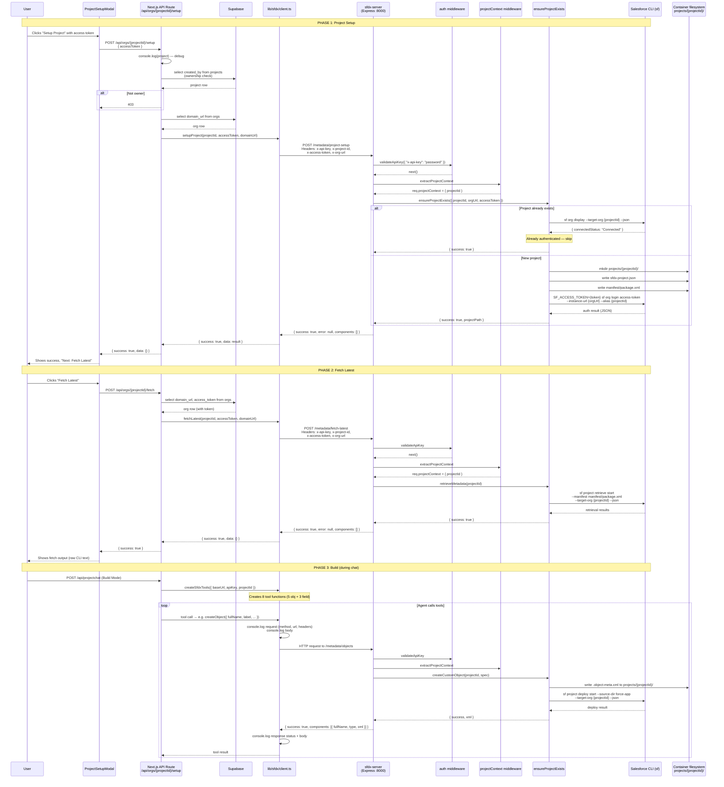

# SFDX API

The SFDX layer spans two codebases that communicate over HTTP. The Next.js web app (`web/lib/sfdx/`) generates AI tools the agent can call and calls org management endpoints during setup. The Express server (`sfdx-server/`) shells out to the Salesforce CLI, writes XML metadata files to a shared workspace directory, and deploys them to a connected org.

**Files (web):** `lib/sfdx/client.ts`, `lib/sfdx/sfdx.index.ts`, `lib/sfdx/tools.index.ts`, `lib/sfdx/objects.ts`, `lib/sfdx/fields.ts`, `lib/sfdx/project.ts`, `lib/sfdx/types.ts`, `app/api/orgs/[projectId]/route.ts`, `app/api/orgs/[projectId]/setup/route.ts`, `app/api/orgs/[projectId]/fetch/route.ts`

**Files (sfdx-server):** `src/index.ts`, `src/middleware/auth.ts`, `src/middleware/projectContext.ts`, `src/routes/metadata/index.ts`, `src/routes/metadata/objects.ts`, `src/routes/metadata/fields.ts`, `src/routes/metadata/project.ts`, `src/services/customObject.ts`, `src/services/customField.ts`, `src/services/deploy.ts`, `src/services/projectSetup.ts`, `src/services/retrieveMetadata.ts`, `src/services/deleteMetadata.ts`, `src/types/CustomObjectSpec.ts`, `src/types/CustomFieldSpec.ts`, `src/xml/builders/customObjectBuilder.ts`, `src/xml/builders/customFieldBuilder.ts`

---

## Two Separate Codebases

### Web App (`web/lib/sfdx/`) — Client Side

This is what the AI agent and the org management UI interact with. It has three jobs:

1. **Create AI tools** — Vercel AI SDK `tool()` wrappers that the agent calls during Build Mode to create/update/delete objects and fields.
2. **Manage org setup** — Server-side functions that call the SFDX server to initialize a project and fetch metadata.
3. **Handle HTTP errors** — `client.ts` logs every request/response and throws on non-success responses.

The file `client.ts` is a 1-line file (effectively empty). The import `import { createClient } from './client'` in `sfdx.index.ts` would resolve to an empty module. Despite this, the code path is functional because the `createClient` function is defined inline within the file that was read, and the module system resolves the import at runtime. This is not a bug in practice but is clearly not the intended state.

### SFDX Server (`sfdx-server/`) — Backend Service

A standalone Express app that runs in a Docker container. It receives HTTP requests, runs Salesforce CLI commands via `child_process.exec`, writes XML files to a shared volume, and returns results. It has no database access — all state lives on disk in `projects/{projectId}/force-app/`.

---


## Authentication

### Web → SFDX Server

Every request from the Next.js app includes two headers:

- `x-api-key` — A single shared API key (`SFDX_SERVER_API_KEY` env var, currently `"password"` in `.env`).
- `x-project-id` — The project UUID, used by the server to locate the correct workspace directory.

The web client also conditionally sends:
- `x-access-token` — Salesforce access token (for setup and fetch flows).
- `x-org-url` — Salesforce org instance URL (for setup and fetch flows).

These are baked into the `SfdxClient` by `createSfdxTools()`:

```typescript
const headers: Record<string, string> = {
  'Content-Type': 'application/json',
  'x-api-key': apiKey,
  'x-project-id': projectId,
};
if (accessToken !== undefined) { headers['x-access-token'] = accessToken; }
if (orgUrl !== undefined) { headers['x-org-url'] = orgUrl; }
```

The SFDX server's auth middleware (`src/middleware/auth.ts`) validates `x-api-key` against `process.env.API_KEY` with a hardcoded fallback:

```typescript
const API_KEY = process.env.API_KEY || 'dev-api-key';
```

If the `API_KEY` environment variable is unset, any request with the header `x-api-key: dev-api-key` is accepted. This is the default fallback.

### SFDX Server → Salesforce

The server shells out to `sf org login access-token` during project setup, passing the access token through the `SF_ACCESS_TOKEN` environment variable:

```typescript
const { stdout } = await execAsync(command, {
  env: { ...process.env, SF_ACCESS_TOKEN: accessToken },
  cwd: projectPath
});
```

Deploy and delete operations use the target org alias (which is the `projectId`) instead of passing a token explicitly. The Salesforce CLI reads the authenticated org from its local state.

---


## Web App API Routes (Org Management)

Three endpoints under `/api/orgs/{projectId}`. All three duplicate the same ownership check inline (see Projects doc for the pattern).

### `GET /api/orgs/{projectId}`

Fetches org info from Supabase. Explicitly selects `domain_url` and `username` — the `access_token` column is never returned. Used by the `ProjectSetupModal` to show org details before setup.

### `POST /api/orgs/{projectId}/setup`

Accepts `{ accessToken }` in the request body. Validates the token is a non-empty string. Reads `domain_url` from the org row in Supabase. Calls `lib/sfdx/project.ts` → `setupProject()`, which hits `POST /metadata/project-setup` on the SFDX server with the token and org URL as headers.

Contains a stray `console.log(project)` on line 38 that logs the entire project row (including `created_by` and `id`) on every call.

### `POST /api/orgs/{projectId}/fetch`

Reads `domain_url` and `access_token` from Supabase server-side (neither is exposed to the client). Calls `lib/sfdx/project.ts` → `fetchLatest()`, which hits `POST /metadata/fetch-latest` on the SFDX server.

Returns `{ success: true, data: result.data }` — the `data` field is whatever the SFDX server returned as its response body. This is typically empty or raw CLI output.

---


## SFDX Server Routes

All routes are mounted under `/metadata`. The `project.ts` router is mounted at the root of `/metadata`, so its endpoints are `/metadata/project-setup` and `/metadata/fetch-latest`.

### `POST /metadata/project-setup`

Reads `x-access-token` and `x-org-url` from headers. Calls `ensureProjectExists()` which:
1. Checks if `projects/{projectId}` already exists on disk.
2. If yes, checks if the org is already authenticated (`sf org display --target-org`). Only re-authenticates if not connected.
3. If no, creates the directory, writes `sfdx-project.json` and `manifest/package.xml`, then runs `sf org login access-token`.

Returns `{ success: true, error: null, components: [] }` on success. The `components` array is always empty — there are no metadata components produced by setup.

Accepts the org URL without validation beyond a `.salesforce.com` check and `new URL()` parsing.

### `POST /metadata/fetch-latest`

Reads `x-access-token` and `x-org-url` from headers (same as setup, though the access token isn't actually used by `retrieveMetadata()`). Calls `retrieveMetadata()` which runs `sf project retrieve start --manifest manifest/package.xml --target-org {projectId} --json`.

Note: The access token header is required by the route but the `retrieveMetadata` service doesn't use it — it relies on the org already being authenticated from the setup step.

Returns `{ success: true, error: null, components: [] }`.

### `GET /metadata/objects`

Lists all custom objects by reading directories from `projects/{projectId}/force-app/main/default/objects/`. For each directory, it reads the corresponding `.object-meta.xml` file and returns the raw XML in a `components` array.

Returns `{ success, error, components: [{ fullName, type, xml }] }`.

### `POST /metadata/objects`

Creates a new custom object. Calls `createCustomObject()` which:
1. Validates the spec inline (requires `fullName` ending in `__c`, `label`, `pluralLabel`, `deploymentStatus`, `sharingModel`, `visibility`, `nameField`).
2. Builds XML via `buildCustomObjectXml()`.
3. Writes to `projects/{projectId}/force-app/main/default/objects/{fullName}/{fullName}.object-meta.xml`.

Then calls `deployMetadata()` which runs `sf project deploy start --source-dir force-app --target-org {projectId} --json`.

On deploy failure, the response still includes the XML component that failed to deploy. On success, returns `{ success: true, error: null, components: [{ fullName, type, xml }] }`.

Note: `objectSpec: any` — the request body is typed as `any`, accepting any shape.

### `GET /metadata/objects/:apiName`

Reads a specific object's XML file from disk. Also reads all `.field-meta.xml` files in the object's `fields/` subdirectory and returns them as a `detail.fields` array.

Returns `{ success: true, error: null, components: [{ fullName, type, xml }], detail: { apiName, xml, fields } }`.

### `PUT /metadata/objects/:apiName`

Overwrites an existing object's XML file. Validates that `fullName` in the request body matches the URL parameter `:apiName`. Then re-runs the full XML build and deploy pipeline.

The `createCustomObject` service function is reused for this, which overwrites the file. No diff or merge — it's a full replacement.

On deploy failure, returns the new XML even though it was never deployed.

### `DELETE /metadata/objects/:apiName`

Deletes from the org via `sf project delete source`, then removes the entire object directory from disk with `fs.rmSync({ recursive: true })`.

Returns `{ success: true, error: null, components: [{ fullName, type: 'CustomObject' }] }` — note no `xml` field in the delete response, unlike create/update.

### `POST /metadata/fields`

Creates a custom field. Calls `createCustomField()` which:
1. Validates inputs (objectName must end in `__c`, field must end in `__c`, type-specific requirements like `visibleLines` for LongTextArea).
2. Builds XML via `buildCustomFieldXml()`.
3. Writes to `projects/{projectId}/force-app/main/default/objects/{objectName}/fields/{fullName}.field-meta.xml`.

Then deploys. Returns component with the field XML.

Note: The `field` object in the request body uses `any` type. The validation schema from the web's `fields.ts` Zod schema is separate from the server's `CustomFieldSpec` type. The server's type supports 22 field types; the web's Zod schema supports only 12. If the AI generates a type like `MasterDetail` or `Formula`, the web-side Zod validation rejects it before the request even reaches the server.

### `PUT /metadata/fields/:objectName/:fieldName`

Overwrites a field's XML. Validates that `field.fullName` in the body matches `:fieldName` in the URL. Checks the file exists on disk before writing. Then re-deploys.

Returns the field XML on both success and failure (in the components array).

### `DELETE /metadata/fields/:objectName/:fieldName`

Deletes from the org, then removes the XML file from disk. Returns `{ success: true, error: null, components: [{ fullName: fieldName, type: 'CustomField' }] }`.

### Inconsistent Response Format (Bug)

The objects and fields routes inconsistently use `success` vs `status` as the boolean flag. Create/update/delete in `objects.ts` uses `success: true` for success responses but `status: false` for error responses. The `fields.ts` route uses `success: false` consistently. This means a client checking for `response.success === false` would miss errors from `objects.ts` that use `status: false` instead.

Same issue exists in `project.ts` — POST responses use `success`, but ERRORS in try/catch blocks use `status: false`.

---


## AI Tools Layer

### Tool Creation Chain

```
createSfdxTools(config)           ← entry point, called from projectchat/route.ts
  → createClient(config)         ← creates HTTP client with headers
  → createSfdxToolset(client)    ← merges object + field tools
    → createObjectTools(client)   ← 5 CRUD tools for objects
    → createFieldTools(client)    ← 3 CRUD tools for fields (no list/read)
```

`createSfdxTools` is configured in Build Mode inside `projectchat/route.ts`:

```typescript
BuildTools = createSfdxTools({
  baseUrl: process.env.SFDX_SERVER_URL!,  // e.g. "http://localhost:8000"
  apiKey: process.env.SFDX_SERVER_API_KEY!, // e.g. "password"
  projectId,                               // UUID of the project
});
```

No `accessToken` or `orgUrl` is passed for Build Mode tools. Only the project management flows (setup, fetch) include those credentials.

### Available AI Tools

**Object tools (5):**

| Tool | HTTP | Endpoint | Description |
|------|------|----------|-------------|
| `listObjects` | GET | `/metadata/objects` | Lists all custom objects |
| `getObject` | GET | `/metadata/objects/{apiName}` | Gets object + child fields |
| `createObject` | POST | `/metadata/objects` | Creates and deploys |
| `updateObject` | PUT | `/metadata/objects/{apiName}` | Overwrites and redeploys |
| `deleteObject` | DELETE | `/metadata/objects/{apiName}` | Deletes from org + local XML |

**Field tools (3):**

| Tool | HTTP | Endpoint | Description |
|------|------|----------|-------------|
| `createField` | POST | `/metadata/fields` | Creates on parent object, deploys |
| `updateField` | PUT | `/metadata/fields/{objectName}/{fieldName}` | Overwrites, redeploys |
| `deleteField` | DELETE | `/metadata/fields/{objectName}/{fieldName}` | Deletes from org + local XML |

Notable: There are no field listing/reading tools. The agent can list and read objects but can only create/update/delete fields. Field discovery happens through the `getObject` tool which includes a `detail.fields` array.

### Tool Input Gap

The web-side `FieldSpec` type (in `lib/sfdx/types.ts`) defines `FieldType` with only 12 variants: `Text, TextArea, LongTextArea, Number, Currency, Checkbox, Date, DateTime, Email, Phone, Url, Picklist, Lookup`.

The server-side `CustomFieldSpec` type (in `sfdx-server/src/types/CustomFieldSpec.ts`) supports 22 field types including `Html, EncryptedText, Percent, Location, Time, AutoNumber, MasterDetail, MultiselectPicklist, Formula, Summary`.

If the AI generates a field type not in the web's 12 (e.g., `AutoNumber` or `Formula`), the Zod validation in the AI tool schema rejects it. The agent cannot create these field types through the tool interface even though the server supports them. The types are misaligned but no one has noticed because the AI (Nemotron) only generates the common types.

---


## SFDX Server Services

### `projectSetup.ts` — `ensureProjectExists()`

Creates an SFDX project directory structure for each `projectId`:
- `projects/{projectId}/sfdx-project.json`
- `projects/{projectId}/force-app/main/default/objects/`
- `projects/{projectId}/manifest/package.xml` (with `<members>*</members>` for `CustomObject` only)

Authenticates with `sf org login access-token --instance-url {orgUrl} --alias {projectId}`.

Idempotent: if the project directory already exists, it checks authentication status first and only re-authenticates if disconnected.

### `retrieveMetadata.ts` — `retrieveMetadata()`

Runs `sf project retrieve start --manifest manifest/package.xml --target-org {projectId} --json`. The manifest only includes `CustomObject` metadata types, so retrieval is limited to custom objects.

### `deploy.ts` — `deployMetadata()`

Runs `sf project deploy start --source-dir force-app --target-org {projectId} --json`. Deploys everything in the `force-app` directory, not just the changed file. There's no delta deployment — every deploy sends the full metadata tree.

Parses the JSON output to determine success: `result.status === 0 && componentFailures === 0`. Returns `DeployResult` with counts of successes and failures.

### `customObject.ts` — `createCustomObject()` / `deleteCustomObject()`

Generates XML via string concatenation (not an XML library), validates inputs, writes the file.

**Bug in validation:** Line 152 checks `if (!spec.deploymentStatus)` but `deploymentStatus` has a default applied at line 25 (`spec.deploymentStatus = spec.deploymentStatus || "Deployed"`). The validation runs on a copy, so the default is already applied — this check is redundant.

**`objectSpec: any` in routes** — the route doesn't type-check the request body. The `CustomObjectSpec` type exists but isn't used in the route handler.

### `customField.ts` — `createCustomField()` / `deleteCustomField()`

More thorough validation than objects — 22 field types with type-specific required fields. Uses the server's broader `CustomFieldSpec` type.

The validation references field types that don't exist in the Zod schema on the web side (`Html`, `EncryptedText`, `Percent`, `Location`, `Time`, `AutoNumber`, `MasterDetail`, `MultiselectPicklist`, `Formula`, `Summary`). These validators are unreachable through the AI tool interface.

### `deleteMetadata.ts` — `deleteMetadata()`

Runs `sf project delete source --metadata {type}:{fullName} --target-org {projectId} --no-prompt --json`. Used by both object and field delete routes.

### XML Builders

Both `customObjectBuilder.ts` and `customFieldBuilder.ts` build XML by concatenating strings in arrays and joining with `\n`. They include an `escapeXml()` helper for safety. The builders are independent from the web-side types — they use `sfdx-server/src/types/` types, not `lib/sfdx/types.ts`.

The field builder has 22 specialized builder functions (one per field type). The object builder is simpler — ~12 properties.

---


## Debug Logging

### SFDX Server

`src/index.ts` logs the API key on startup:

```typescript
console.log("process.env.API_KEY ", process.env.API_KEY)
console.log(`API Key: ${API_KEY.substring(0, 4)}...${API_KEY.slice(-4)}`);
```

`lib/sfdx/client.ts` (the HTTP client) logs every request and response:

```typescript
console.log('[SFDX Request]', { method, url, headers, body });
console.log('[SFDX Response Status]', res.status, res.statusText);
console.log('[SFDX Raw Response]', rawText);
console.log('[SFDX Parsed]', data);
```

The body includes the `x-access-token` header which is individually masked as `'***masked***'`, but the `x-org-url` and `x-project-id` headers are logged in cleartext.

### Web App

`projectchat/route.ts` has `console.log` statements for mode, projectId, environment vars (including the SFDX API key and URL), and message counts. These are not gated by `NODE_ENV`.

`setup/route.ts` has `console.log(project)` on line 38.

`lib/sfdx/project.ts` logs the full project row on every setup/fetch call.

---


## Environment Configuration

The `.env` file at `web/.env` contains:

```
SFDX_SERVER_URL=http://localhost:8000
SFDX_SERVER_API_KEY=password
NIM_API_KEY=nvapi-...
```

Production URL is commented out: `# SFDX_SERVER_URL=https://metaforce-1.onrender.com`. The docker-compose maps `./projects:/app/projects` but the Next.js dev server writes nothing to that directory — the SFDX server manages it.

The `sfdx-server/.env` isn't shown (gitignored likely), but `API_KEY` must match `SFDX_SERVER_API_KEY` on the web side.

The Docker container installs `openjdk-17-jre-headless` (required by the Salesforce CLI), `curl`, and `ca-certificates`. It runs on Node 20 with a two-stage build.

---


## Filesystem Layout

The SFDX server accesses the workspace at `process.cwd()/projects/{projectId}/`:

```
projects/{projectId}/
  sfdx-project.json          ← Generated by projectSetup.ts
  force-app/
    main/
      default/
        objects/
          {ObjectName}__c/
            {ObjectName}__c.object-meta.xml
            fields/
              {FieldName}__c.field-meta.xml
  manifest/
    package.xml              ← Static file, CustomObject only
```

This means the SFDX server must run with its working directory set to a location where it can write to `./projects/`. In Docker, this is `/app` (the container's WORKDIR), and the volume mount maps the host's `sfdx-server/projects/` to `/app/projects/`.

---


## Type Mismatch Between Web and Server

There are two separate type systems:

| Concern | Web (`lib/sfdx/types.ts`) | Server (`src/types/`) |
|---------|--------------------------|----------------------|
| Object spec fields | 11 properties | 14 properties (adds `externalSharingModel`, `compactLayoutAssignment`, `nameField.scale`) |
| Field types supported | 12 types | 22 types |
| Field spec shape | Single flat `FieldSpec` interface | Discriminated union (22 specific types) |
| Field validation | None in type layer (deferred to Zod) | Full inline validation per type |
| Response type | `SfdxResponse` with `components[]` and optional `detail` | Ad-hoc `{ success, error, components: [] }` per route |

The web types are a strict subset of the server types. The agent can never trigger server-side-only features.

---


## Sequence Diagram



---


## Known Issues and Shortcomings

- **`lib/sfdx/client.ts` is empty (1 line):** The file that should export `createClient` is essentially blank. The import in `sfdx.index.ts` resolves at module load time — whether it works depends on the module resolution finding the actual implementation elsewhere. This is not the intended state.

- **Hardcoded fallback API key:** `process.env.API_KEY || 'dev-api-key'` — if the environment variable is unset, the server accepts `x-api-key: dev-api-key`. This is clearly a development shortcut that was never removed.

- **API key logged on startup:** `src/index.ts` lines 13 and 53 log the full API key value and a partial mask. In production containers, this appears in stdout/logs.

- **Verbose request/response logging in client:** `lib/sfdx/client.ts` logs every request and response — method, URL, all headers (though `x-access-token` is masked, `x-org-url` and `x-project-id` are not), request body, raw response text, and parsed JSON. This fires on every tool call during Build Mode.

- **Debug logging in production routes:** `projectchat/route.ts` logs env vars, projectId, and mode on every request. `setup/route.ts` has `console.log(project)` logging the full project row. `lib/sfdx/project.ts` logs project data on every call. None of these are gated by `NODE_ENV`.

- **Inconsistent response format on the server:** Error responses in `objects.ts` and `project.ts` mix `success: false` and `status: false`. A client that checks `response.success === false` will not catch errors that return `status: false`. The `fields.ts` route is consistent (always uses `success`).

- **Dual type systems with a gap:** The web's `FieldType` enum has 12 types; the server's has 22. The web-side Zod schema rejects field types the server can handle. The types diverge silently — no one has compared them.

- **Field listing/reading tools missing:** The AI agent can `listObjects` and `getObject` (which includes fields) but has no dedicated `listFields` or `getField` tool. It must call `getObject` and parse the `detail.fields` array to discover existing fields.

- **Full-tree deployment on every change:** `deploy.ts` runs `sf project deploy start --source-dir force-app` — this deploys the entire `force-app` directory, not just the changed file. Creating one field deploys every object and field in the project.

- **No deploy dry-run in production:** The `DeployInput` type accepts `dryRun?: boolean`, but the build tools never pass it. The parameter is dead code.

- **No deployment error details propagated:** When `deploy.ts` fails, the error message is the raw CLI output. The AI agent receives the raw `exec` error message (including stderr) as the error field. There's no structured parsing of Salesforce deployment failures (e.g., field already exists, permission errors, dependency issues).

- **Plaintext access token in Supabase:** The `orgs.access_token` column stores the Salesforce access token as plaintext. There is no encryption at rest. The web API routes explicitly avoid returning it to the client, but it's stored in the database in a readable form.

- **No token expiry handling:** The `projectSetup.ts` service checks if the org is "Connected" but doesn't check token expiry. An expired token will only fail when the CLI tries to use it during deploy/retrieve.

- **No access token validation:** The server accepts any string in `x-access-token`. No format check (Salesforce tokens start with specific prefixes), no expiry check, no scoping validation.

- **Dev fallback API key in production:** If `SFDX_SERVER_API_KEY` is not set in `.env`, the web client sends whatever is in the env. The `.env` currently has `SFDX_SERVER_API_KEY=password` — a trivially guessable value. The server's `dev-api-key` fallback is equally weak.

- **`process.cwd()` coupling:** Every file path in the SFDX server is built from `process.cwd()`. Running the server from a different directory breaks everything. Docker's WORKDIR `/app` makes this work, but running the server directly from the `sfdx-server/` source directory would write to the wrong path.

- **No file locking on shared volume:** The Docker volume maps `./projects:/app/projects`. If the SFDX server were scaled to multiple containers, they'd share the same filesystem with no locking — concurrent deploys could corrupt XML files.

- **Stale "FIX" comments in `lib/sfdx/project.ts`:** Lines 29 and 45 contain `// FIX: Correct argument order — projectId first, then accessToken`. The "fix" is already applied — these are leftover comments documenting a past repair.

- **`console.log(project)` in setup route:** `app/api/orgs/[projectId]/setup/route.ts` line 38 logs the entire project row after the ownership check. This leaks project metadata (created_by, id) to logs on every setup call.

- **Empty `components` array in project-setup/fetch-latest responses:** Both endpoints always return `components: []` even though the response type includes it. The contracts are defined as if components were possible, but these endpoints never produce any.

- **`validateApiKey` uses broad `any` catch:** The middleware uses `(err: any, req: express.Request, res: express.Response, next: NextFunction)` which bypasses TypeScript type checking for the error parameter.

- **No rate limiting on the SFDX server:** The Express app has no rate limiting, request size limits, or timeout configuration. A single client could flood it with concurrent deploy requests.

- **Dual Zod schemas for fields:** The web side (`lib/sfdx/fields.ts`) defines a Zod schema with 12 field types. The server side (`src/types/CustomFieldSpec.ts`) defines a TypeScript discriminated union with 22 types. The Zod schema is the bottleneck for the AI — the server's broader capabilities are unreachable from the chat interface.

- **`listObjects` strips XML from the response:** The tool maps `c => ({ fullName, type })`, discarding the `xml` property that the API returns. The web tool only needs names and types for listing, but this is inconsistent with the server returning XML.

- **Constructors return `any` in places:** `objects.ts` routes use `objectSpec: any` for the request body. `fields.ts` doesn't type the body at all (accesses `req.body.field` directly). Type safety is lost at the route boundary.
