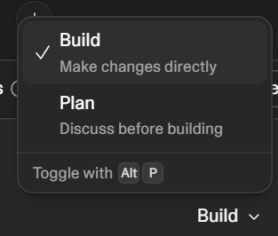

change the build and plan from toggle to drop down to look like this: , but do not include the alt p part and there should be no primary colors on any of them, also change the actions dropdown to look like that

also i noticed the color of the send button is affected by the state of the input, it's as if the button is behind the gray scale of the input section, can we fix that

for the sidebar: 
- the open icon should be changed
- it should not open anytime the page loads, it should only open when new data is added to it
- when it is closed there should be more padding on the sides

the input element sits on this panel and it doesnt look good the input should sit on the page on the text itself

when the agent is thinking, the thinking drop down element should be opened and as the agent thinkis, it should scroll, and when the agent is done thinking, it should close and show the agent's output, also we should add the shimmer effect when the agent is thinking

 we are building a landing page. this is our example page: .claude\context\linkify\src\app\(marketing)\page.tsx and this is the one we are building: 
  web\app\page.tsx, we have implemented quite a few. 